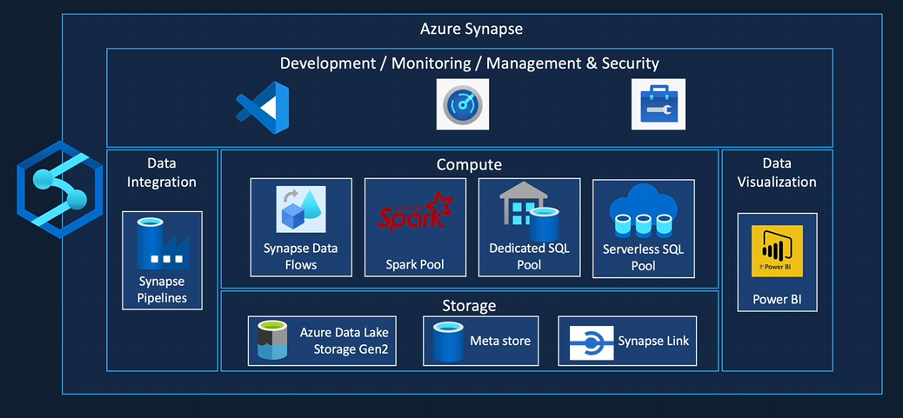
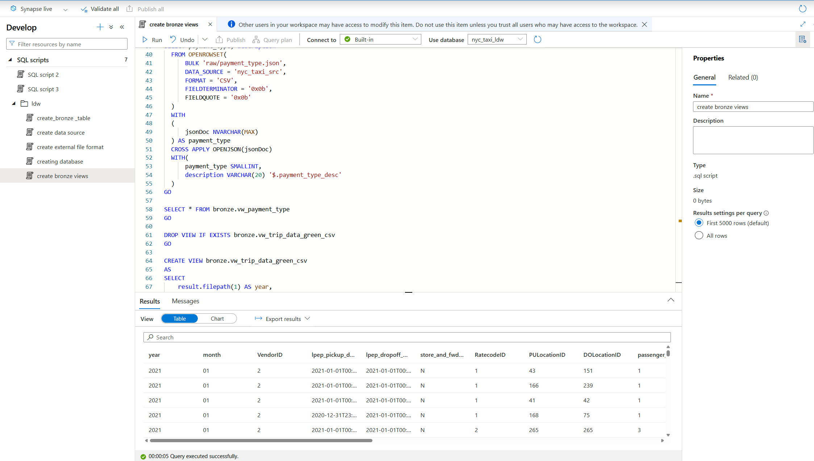
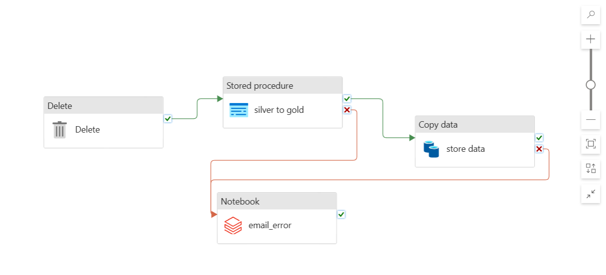
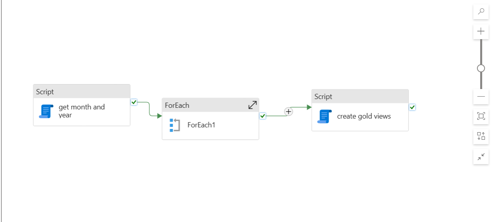

# NYC-Taxi-data-engineering-project

## Project Summary

This project showcases a complete data engineering workflow for analyzing New York City taxi data using Azure Synapse Analytics. The process covers the full pipeline, from raw data ingestion to generating business insights through Apache Spark, SQL Pools, and Power BI visualizations.

## Dataset Overview

The data is sourced from NYC’s official records and includes three categories of taxi services: Yellow Taxis, Green Taxis, and For-Hire Vehicles. The analysis considers geographical divisions based on NYC boroughs and uses seven core tables: Trip Data, Taxi Zones, Calendar, Trip Type, Payment Type, Rate Code, and Vendor information.

## Architecture and Tools

The architecture relies on several Azure Synapse components:

- Azure Data Lake Storage for organizing data across raw, bronze, silver, and gold layers  
- Apache Spark for distributed data transformations  
- Serverless SQL Pools for querying data  
- Synapse Pipelines for orchestration and automation  
- Power BI for building data visualizations  

This setup provides a scalable solution for handling large volumes of structured and semi-structured data.

## Data Pipeline Explanation

The data flows through three main stages:

- **Raw Layer**: Raw CSV and Parquet files are ingested into a dedicated storage container.  
- **Bronze to Silver Transformation**: Raw data is cleaned, validated, and structured using Spark notebooks and stored as External Tables.  
- **Silver to Gold Transformation**: Data is further processed and aggregated using SQL views, CETAS (Create External Table As Select), and stored procedures to prepare it for reporting.  

This layered approach ensures data quality, reusability, and performance optimization.

## Synapse Pipelines

Multiple Synapse pipelines automate different stages of the data processing workflow:

- Creating Silver layer External Tables  
- Partitioning and processing trip data  
- Converting Silver data to the Gold layer  

  

Pipeline triggers manage execution schedules, enabling automatic and repeatable data workflows.

## Project Budget

The project incurs costs primarily in:

- Azure Synapse Analytics Workspace  
- Serverless SQL Pool usage  
- Synapse Pipeline executions  
- Data Lake Storage for raw and processed data  

Monitoring usage and cost is essential to ensure the project remains within budget.

